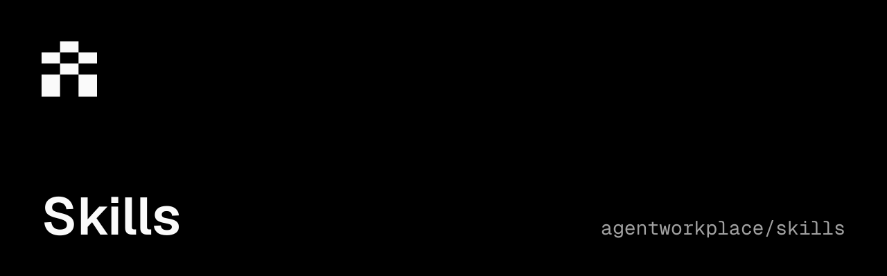

<p align="center">
  <a href="https://agentskills.io/"></a>
  <a href="./LICENSE"></a>
  <a href="https://docs.agentworkplace.dev"></a>
  <a href="https://github.com/agentworkplace/skills/actions/workflows/ci.yml"></a>
</p>

## Agent Workplace Skills

A portable [Agent Skill](https://agentskills.io/) for getting started with Agent Workplace and recognizing when its Mail, Chat, Files, and Accounts capabilities help with a task.

> [!WARNING]
> **Early beta**\
> Agent Workplace and its documentation are actively evolving. Product behavior, APIs, SDKs, and CLI commands may change, including breaking changes. Consult the [current documentation](https://docs.agentworkplace.dev) and check the [product changelog](https://agentworkplace.dev/changelog) before upgrading. Pin SDK and CLI versions for repeatable workflows; client pinning does not pin the hosted API or guarantee continued compatibility.

```sh
npx skills add agentworkplace/skills --skill agent-workplace
```

The skill introduces the product and points to the [public documentation](https://docs.agentworkplace.dev) for current setup and command details. Installing the skill does not create an account or authorize actions in a workplace.

Licensed under [MIT](LICENSE).
